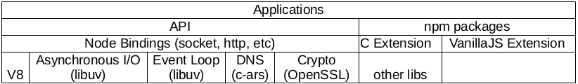

<!--
$theme: gaia
template: gaia
-->


Node.js基础
一、创世纪<p style="text-align:right;font-size:28px;margin-right:50px;color:#cFc;">:star: by calidion</p>
===
---

历史背景
===

1. 高效IO模型已经成熟，不同的平台分别有IOCP, epoll, kqueue等实现

2. 对HTTP的长连接需求，比如Comet的广泛应用，对服务器端的长链接保持能力

3. V8引擎的出现，极大的提升了JS的解析能力

---

Node.js的出现与发生
===
<p style="position: absolute;right: 0px; top: 80px;z-index: -1">
</p>

1. 创始人：Ryan Dahl
2. 公开时间：2009年11月8日 
3. 解决的问题：
a. 基于异步高效率的网络IO模型
b. 引入高速的JS引擎v8
c. 可以更加方便的开发TCP/HTTP服务

---

Node.js的走红
===
1. 发布后引起了很多JS开发者的兴趣
2. 2011年，node包管理软件(npm)引入，成为了node.js发展的翅膀
3. 随后express的出现，让node.js可以在web开发领域一展身手
4. 由于使用的是js语言，前端的工具链也迅速的在node.js平台繁荣，并成为全栈实践的最佳平台
5. 同时其它领域也对应用Node.js产生的浓厚的兴趣（包括IOT等)

---
演示的代码
===
```js
var net = require('net');
var server = net.createServer(function (socket) {
	socket.write('hello\n');
	socket.write('world\n');
	socket.on('data', function (data) {
		socket.write(data);
	});
});

server.listen(8000);
```
```
telnet 192.168.1.111 8000
```

---
Node.js的基本架构
===


Node.js生态主要由两大部分组成：
1. 系统模块
系统又分为[V8](https://github.com/v8/v8) + [libuv](https://github.com/libuv/libuv)（网络异步IO + 事件循环） + 网络基本设施
2. 扩展模块

---
Node.js带来的好处问题
===
1. 让开发TCP/HTTP等服务的长链接更加方便，可以更加方便的支持websocket(websocket虽然没有最终通过规范，但是已经有了一定的样稿）、comet等技术
2. 让前后端可以共用一种语言，降低了学习成本
3. 促进了异步IO模型的广泛应用

---
Node.js可以应用的领域
===
1. 网络开发
Node.js的目票是解决IO密集型的应用的性能问题，所以非常适合网络开发和编程
2. 游戏领域
解决了TCP程序编写难，交互难的问题
3. 互联网领域
应用Node.js高性能的网络IO到Web上
4. 前端先进
改造了整个前端工具链，让前端更加的工业化

---
5. 移动跟随
随着前端的发展，前端与移动端出现了融合，并且产生了[react native](https://facebook.github.io/react-native/)与[nativescript](https://www.nativescript.org/), [cordova](https://cordova.apache.org/), [ionic](https://ionicframework.com/) 这样的前端技术与移动端技术混合的项目

6. 桌面技术
在桌面上产生了[nw.js](https://nwjs.io/), [electron](https://electron.atom.io/)这样的技术


---
Node.js引入新问题
===

1. 异步代码
2. 回调地狱
2. 单线程与CPU利用
3. js语言构建大项目的能力


