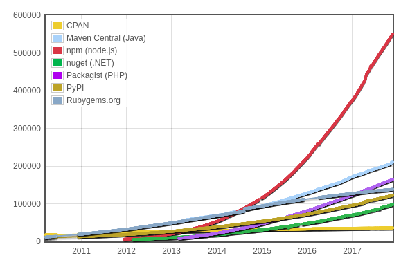

<!--
$theme: gaia
template: gaia
-->


Node.js基础
npm包管理器<p style="text-align:right;font-size:28px;margin-right:50px;color:#cFc;">:star: by calidion</p>
===
---
npm（node package manager)
===

1. 目前最大的包管理软件生态
2. node.js的默认管理器，安装完成后自带
3. 基于SEMVER
4. 存放在node_modules目录

官方教程：
https://docs.npmjs.com/getting-started/

官网：
https://www.npmjs.com/

---
其它语言的包管理系统
===
1. perl
The Comprehensive Perl Archive Network (CPAN) 

2. php
PEAR - PHP Extension and Application Repository

3. python
PIP

4. ruby
gem

---

5. java
maven

各种语言包的数量变化图

[](./images/pol.png)

---
包管理软件的基本功能
===
1. 上传，发布，下载包
2. 对包的更新版本进行管理
3. 用户权限的管理

npm（宽松）
其它（相对严格）

---
SEMVER
===
官方网址：

https://semver.org/

1. 格式：
Major.Minor.Patch
2. 示例：
1\.0.0, 1.2.3-beta, 2.0.1

---

3. 发布要求：
从1.0.0起
a. 如果是补订升级，修改最后一位。比如升级到1.0.1
b. 如果是新功能但是不破坏接口兼容性，修改中间位。比如升级到1.1.0
c. 如果是不兼容修改，升级第一位。比如2.0.0

---
4. 用户接收版本更新规则

Patch releases: 1.0 or 1.0.x or ~1.0.4
Minor releases: 1 or 1.x or ^1.0.4
Major releases: * or x

通常放置于`dependencies`/`devDependencies`属性之下。

---
版本更新示例
===

1. B包

依赖了A，依赖规则
“^2.0.0”
“2.x"

2. C包

依赖了A，依赖规则
“2.0.x”
“~2.0.1”
“2.0”

---

3. D包

依赖了A，依赖规则
“*”
“x”

----

对于A包具有如下版本
1.0.1
1.0.2
2.0.0
2.0.1
2.0.2
2.0.5
2.1.1
2.2.1
2.3.1
3.0.0
3.0.1

---
问下载B，C，D包分别下载那个版本的包？

B => 2.2.1
C => 2.0.5
D => 3.0.1

---
npm安装或者更新
===

```
npm install npm@latest -g
```

理解npm v2, v3, v5之间的差别
nested => flat => version specific

---

包安装
===
1. 最通用
```
npm install <package[@version]>
```
2. 简写
```
npm i 
```
3. 存为依赖包
```
npm i --save
```
---

4. 存为开发依赖包
```
npm i --save-dev 
```

4. 存为严格版本的依赖包
```
npm i --save-exact 
```

5. 全局安装
通常是命令行包

```
npm i -g
```
示例:
```
npm i -g http-server
```
---

6. 帮助
```
npm install --help

npm install (with no args, in package dir)
npm install [<@scope>/]<pkg>
npm install [<@scope>/]<pkg>@<tag>
npm install [<@scope>/]<pkg>@<version>
npm install [<@scope>/]<pkg>@<version range>
npm install <folder>
npm install <tarball file>
npm install <tarball url>
npm install <git:// url>
npm install <github username>/<github project>

aliases: i, isntall, add
common options: [--save-prod|--save-dev|--save-optional] [--save-exact] [--no-save]
```

---

本地 vs 全局
===
本地不加-g
全局加-g

1. 安装

```
npm install 
npm install -g
```
2. 删除

```
npm uninstall 
npm uninstall -g
```
---

3. 更新

```
npm update 
npm update -g
```

3. 查看本地/全局安装的包
```
npm list
npm list -g
```


---

查看信息
===
1. 查看所有版本

```
npm show express@* version
```

2. 查看包信息

```
npm view express
```

---
搜索
===

```
npm search <key>
```

---
node.js模块与npm包的关系
==

1. npm包是1个或者多个node.js模块的组合
2. node.js模块天然是以单个文件组织范围
3. npm包可以多个文件，加多个包的集合

---

package.json文件
===
1. 作用
a. 当前包的描述文件
b. 存放了包的依赖关系

2. 至少包含两个属性
a. name: 小写字母，不能在空格,`-`或者`_`也可用
b. version: SEMVER版本号
3. 示例
```
{
  "name": "my-awesome-package",
  "version": "1.0.0"
}
```
---
其它描述性属性
===
1. license
即协议属性，常见的属性有MIT, GPL, Apache, BSD
2. description
包描述，对当前包的介绍

3. keywords
关键字，方便被搜索到

4. author
作者信息

---
功能性描述
===
1. main属性

用于指定进入包的位置
比如 
```
"name": "package1",
"main": "app.js"
```
这时

```
let a = require("package1");
```
就会引入`app.js`文件

---
npm默认进入点`index.js`
===
对于包a`node_modules/a/`有index.js
```
exports.a = "Hello World!";
```
测试文件：

```
// test.js
var a = require("a");
console.log(a);
```
输出结果：

```
{ a: 'Hello World!' }
```
---

2. repository

代码所在的库

```
  "repository": {
      "type": "git",
      "url": "https://github.com/bnb/metaverse.git"
  }
```

---

3. dependencies
当前包运行所依赖的包
不必包含系统已经有的包

通过
```
npm install --save
```
更新

---

4. devDependencies
开发依赖

通过
```
npm install --save-dev
```
更新

问题：
1. 开发者adam在开发包a时，发现需要使用b,c,d,e包，但是这个时候adam发现他为了测试a包，又需要添加，f, g, h, i等包。而在b包里包含有对g包的依赖。
请问，在npm v2与v3下，a包必要安装那些包用于测试？

---

5. bin

作为命令行时运行的文件

```
bin: 'cli.js'
```
示例：
对于a包
```
a
├── a.js
└── package.json
```
---

a. package.json文件内容

```
{
  "name": "a",
  "version": "1.0.0",
  "description": "",
  "main": "index.js",
  "scripts": {
    "test": "echo \"Error: no test specified\" && exit 1"
  },
  "author": "",
  "bin": "a.js",
  "license": "ISC"
}

```

---

b. a.js文件内容
```
#!/usr/bin/env node
console.log("Hello world!");
```

c. 安装到全局

```
npm install -g a
```
a是包目录名

---
修改命令名
===

```
{ "bin" : { "hello" : "./a.js" } }
```

---
6. files属性
指定发布时应该包含的文件。


a. 默认必发布文件：
package.json
README
CHANGES / CHANGELOG / HISTORY
LICENSE / LICENCE
NOTICE

---
b. 默认必不包含文件：

```
.git CVS .svn .hg .lock-wscript .wafpickle-N .*.swp 
.DS_Store ._* npm-debug.log .npmrc node_modules
config.gypi *.orig package-lock.json
```

---


7. scripts

运行脚本的描述属性

```
  "start": "node server.js",
  "build": "node app.js",
  "test": "standard"
```

---
自动化生成package.json
===
```
npm init
npm init --yes
```
---

发布包
===
1. 创建发布用户帐户

```
npm adduser
```

2. 用户登录

```
npm login
```
3. 发布包

```
npm publish
```
.gitignore和.npmignore包含的目录与文件除外

---
SEMVER带来的问题
===
1. 带来版本的飞升
2. 版本的识别价值降低
3. 大部分情况下目标通常无法保证
4. npm包非常不稳定


---

nested vs flat
===
npm2 nested
npm3+ flat
问题：
nested: 导致代码臃肿
flat: 导致目录臃肿

---

竞争对手-yarn
===
一个更加精确的版本管理软件
克服了SEMVER的部分问题
增强了npm包的稳定性
增强了npm包的可移植性
起来越受欢迎

---
npm包与系统自带的包的区别
===
1. npm包需要安装，系统自带的包不需要
2. npm包是由第三方维护的，系统包是由node.js团队维护的
3. npm包分成纯js的包与编译的包。纯JS的包，兼容性相对要好一些。编译的包在不同的平台可能兼容性不一致

---
国内下载慢的解决
===
创建
```
~/.npmrc
```
文件，并添加如下的内容
```
registry=https://registry.npm.taobao.org/
disturl=https://npm.taobao.org/dist
chromedriver_cdnurl=http://cdn.npm.taobao.org/dist/chromedriver
operadriver_cdnurl=http://cdn.npm.taobao.org/dist/operadriver
phantomjs_cdnurl=http://cdn.npm.taobao.org/dist/phantomjs
fse_binary_host_mirror=https://npm.taobao.org/mirrors/fsevents
sass_binary_site=http://cdn.npm.taobao.org/dist/node-sass
electron_mirror=http://cdn.npm.taobao.org/dist/electron/
```


