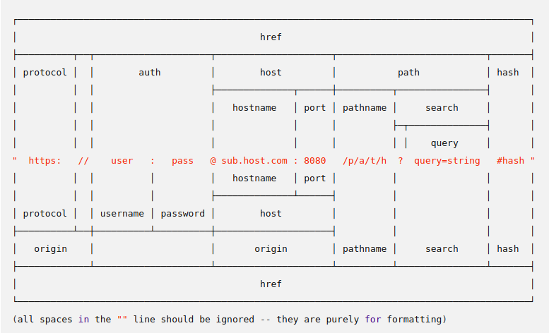

<!--
$theme: gaia
template: gaia
-->


Node.js
Web开发<p style="text-align:right;font-size:28px;margin-right:50px;color:#cFc;">:star: by calidion</p>
===
---
认识HTTP
====
对应协议： [rfc2616](https://www.w3.org/Protocols/rfc2616/rfc2616.html)
1. HTTP是TCP/IP协议的应用层协议，基于TCP层之上的协议，也是基于SOCKET连接方式的协议
2. 默认的HTTP端口号是80
2. HTTP请求是按不同的方法（METHOD）进行的
3. HTTP请求是无状态的请求，只有一个请求与回应
4. HTTP返回有状态码
5. HTTP头包含有很多有价值的信息
6. 通常是基于URI访问资源，是WWW服务的基础

---
HTTP常用方法
===
1. GET方法
最常见的方法，用于从URI获取WWW资源，通常不会影响服务器或者用户的状态

2. POST方法
用于向服务器发送用户请求信息，通常会导致一些用户状态切换或者服务器数据变化

3. PUT方法
用于文件/资源的创建与更新

4. DELETE方法
用于文件/资源的删除

---

5. HEAD方法
请求HTTP头信息，用于下载大文件时或者缓存

6. OPTIONS方法
用于检测服务器支持的方法。比如是不是支持WebSocket。

---
HTTP状态码
===

分成五类

* 1xx Informational， 表示信息提示相关的
* 2xx Successful， 表示成功的
* 3xx Redirection，重定向
* 4xx Client Error，客户端错误
* 5xx Server Error，服务器错误

---

* 1xx Informational， 表示信息提示相关的
100 Continue，继续
**101 Switching Protocols，协议切换**

---

* 2xx Successful， 表示成功的
**200 OK，成功**
201 Created，创建成功
202 Accepted，接收成功
203 Non-Authoritative Information，非授权信息
204 No Content，没有内容
205 Reset Content，内容重置
206 Partial Content，部分内容

---

* 3xx Redirection，重定向
300 Multiple Choices，多重选择
**301 Moved Permanently，永久移动**
**302 Found，找到**
303 See Other，查看其它页面
**304 Not Modified，没有修改**
305 Use Proxy，使用代理 
307 Temporary Redirect，临时重定向

---

* 4xx Client Error，客户端错误
**400 Bad Request，不良请求**
401 Unauthorized，没有授权
402 Payment Required，需先付款
**403 Forbidden，禁止**
**404 Not Found，未找到**
405 Method Not Allowed，方法不允许
406 Not Acceptable，无法接收
407 Proxy Authentication Required，无法接收
408 Request Timeout，请求超时
409 Conflict，冲突
410 Gone，走了
---

411 Length Required
412 Precondition Failed
413 Request Entity Too Large
414 Request-URI Too Long
415 Unsupported Media Type
416 Requested Range Not Satisfiable
417 Expectation Failed

---
* 5xx Server Error
**500 Internal Server Error，服务器内部错误**
501 Not Implemented，没有实现
**502 Bad Gateway，网关错误**
**503 Service Unavailable，服务不存在**
**504 Gateway Timeout，网关超时**
505 HTTP Version Not Supported，HTTP版本不支持

---
HTTP头信息
===
1. Authentication
[Authorization]
2. Caching
[Age，Cache-Control，Expires]
3. Conditionals
[Last-Modified]
4. Connection management
[Connection, Keep-Alive]

---
5. Content negotiation
[Accept, Accept-Charset]
6. Cookies
[Cookie, Set-Cookie]
7. CORS
[Access-Control-Allow-Origin, Access-Control-Allow-Credentials,
Access-Control-Allow-Methods]
8. Downloads
[Content-Disposition]

---

9. Message body information
[Content-Length, Content-Type]
10. Proxies
[Forwarded]
11. Redirects
[Location]
12. Request context
[Host, Referer, User-Agent]
13. Response context
[Allow, Server]

---

14. Range requests
[Accept-Ranges, Range]
15. Security
[Content-Security-Policy]
16. Transfer coding
[Transfer-Encoding]
17. WebSockets
[Sec-WebSocket-Key]
18. Other
[Date, Vary]

---
Web服务器基本功能列表
===

1. 处理HTTP方法
2. 处理路由
3. 处理地址上的参数
4. 处理cookie与session
5. 处理表单
6. 处理文件上传

----
最基本的HTTP服务器
===
```
var http = require('http');

//create a server object:
http.createServer(function (req, res) {
  res.write('Hello World!\n'); //write a response to the client
  res.end(); //end the response
}).listen(8080); //the server object listens on port 8080
```


---
添加HTTP头
===
```
var http = require('http');
http.createServer(function (req, res) {
  res.writeHead(200, {'Content-Type': 'text/html'});
  res.write('Hello World!');
  res.end();
}).listen(8080);
```
---
获取请求url
===
```
var http = require('http');
http.createServer(function (req, res) {
    res.writeHead(200, {'Content-Type': 'text/html'});
    res.write(req.url);
    res.end();
}).listen(8080);
```

---
url
===


---
路径的解析
===
```
const http = require('http');
const url = require('url');
const server = http.createServer((req, res) => {
  let path = url.parse(req.url);
  res.write("url is" + req.url + "\n");
  res.end("PATH is" + path.pathname + "\n");
});
let port = process.env.NODE_PORT || 8080;
server.listen(port, () => {
	console.log("Server started at: " + port);
});
```
shell测试命令
```
curl -X PUT http://localhost:8080/heelo/wowow/index.html?hell=10101
```
---

判断路由
===
```
var http = require('http');
var url = require('url');

//create a server object:
http.createServer(function (req, res) {
  var parsed = url.parse(req.url);  
  // router
  if (parsed.pathname === 'router') {
  // 处理Router
  }
}).listen(8080); //the server object listens on port 8080

```
---
路由编写
===
1. 基于pathname的字符串直接匹配
形式
```
	if (['/user/signin', '/user/login'].indexOf(parsed.pathname) !== -1) {
		return user.login(req, res);
	}
```

2. 基于正则表达式匹配
形式
```
  if (/^\/reg\/(.*)$/g.test(pathname)) {
  // XXX
  }
```
---
判断HTTP方法
===

服务器代码：

```
const http = require('http');
const server = http.createServer((req, res) => {
	res.end("METHOD IS" + req.method + "\n");
});
let port = process.env.NODE_PORT || 8080;
server.listen(port, () => {
		console.log("Server started at: " + port);
});

```
shell测试命令

```
curl -X PUT http://localhost:8080
```

---

URL请求参数解析
===
```
const http = require('http');
const url = require('url');
const qs = require('querystring');
const server = http.createServer((req, res) => {
  let params = qs.parse(url.parse(req.url).query);
  console.log(params);
  res.end("params is parsed\n");
});

```
shell测试命令
```
curl -X PUT http://localhost:8080/heelo/wowow/index.html?hell=10101
```
---
Cookie 与 Session
===

| 说明  | Cookie | Session/Token |
| :---: | :---: | :---: |
| HTTP协议规范 | Y | N |
| 主要数据保存在服务器 | N | Y |
| 主要数据保存在客户端 | Y | N |
| 必须放在HTTP头 | Y | N |
| 可以存大量数据 | N | Y |
| 可以通过服务器设置 | Y | Y |
| 可以通过客户端设置 | Y | N |

---
Cookie基本的流程
===
1. 服务器Set-Cookie设置Cookie值
2. 客户端保存设置的Cookie
3. 在新的请求中带上Cookie

问题:
1. Cookie容易被修改
2. Cookie容易被伪造（CRSF）

---
Session的基本流程
===
1. 客户端请求服务器，并验证身份
2. 服务器发送一个token
3. 客户端根据token访问服务器

---

Cookie处理
===

1. 服务器设置Cookie指令(Set-Cookie)

```
var http = require('http');
http.createServer(function (req, res) {
  res.writeHead(200, {
    'Set-Cookie': 'mycookie=test',
    'Content-Type': 'text/plain'
  });
  res.write('Hello World!');
  res.end();
}).listen(8080);
```


shell测试

```
curl -X GET http://localhost:8080/heelo/wowow/index.html?hell=10101
```

----
Session处理
===
Session即会话，是HTTP协议无状态而产生的一个补充用户验证方法


要完成一个Session需要几个基本要素

1. 用户验证
2. 产生唯一的token/id
3. 根据token/id在后继请求里识别用户

---
Session两种基本实现方式
===
1. 基于Cookie（多数语言默认）
```
Cookie: sid=b2RzZm9zZmQ=
```
2. 基于URL的Query String（常用于OAuth)
```
http://localhost/?sid=b2RzZm9zZmQ=
```

sid是可以任意指定。比如，PHP里它是PHPSESSID

---

安全问题：
1. 加时间戳
2. 更新token

---
Cookie与Session产生关系
===
1. Session只需要一个Token或者ID就能识别用户
2. Cookie可以设备多种数据，实现多种功能
2. 通常各种利用Cookie来维持Session
2. 比如PHP里面PHPSESSID=xxx的Cookie值来表示SESSION的ID值
3. expressjs里面，默认使用sid的Cookie值来表示session的ID


---

Session示例
===
```
var http = require('http');
http.createServer(function (req, res) {
  res.writeHead(200, {'Set-Cookie': 'sid' + id });
  res.write('Hello World!\n');
  res.end();
}).listen(8080);
```

其中sid就是session的ID

shell测试

```
curl -X GET http://localhost:8080/heelo/wowow/index.html?hell=10101
```
---

---
处理提交的表单
===
```
if (req.method === "POST") {
  var data = [];
  var length = 0;
  req.on('data', function (chunk) {
      length += chunk.length;
      data.push(chunk);
  });
  req.on('end', function () {
    data = Buffer.concat(data, length);
    // process(data)
  });   
}
```

测试：
```
curl -X POST -d "a=1010&b=100&c=中文" http://127.0.0.1:8080/
```

---
文件的提交
===
[rfc1867](https://tools.ietf.org/html/rfc1867)

1. 获取multi-part属性

```
var contentType =  req.headers['content-type'];

if (contentType.indexOf('multipart/form-data;') !== -1) {
// 有上传文件内容
}
```
---

2. 获取分割符号
```
var splitors = contentType.split("; ");
console.log(splitors);
for(var i = 0; i < splitors.length; i++) {
   console.log("inside for");
  var temp = splitors[i];
  console.log(temp);
  if (!temp) {
    continue;
  }
  if (temp.indexOf("boundary=") !== -1) {
   splitor = temp.split("=")[1];
          break;
  }
}

```
---

3. 获取上传的分段内容

```
// 注意前面多两个--
var parts = String(data).split("--" + splitor);
```
4. 提取分段内容

```
for(var i = 0; i < parts.length; i++) {
  // 注意是二个
  let position = parts[i].indexOf("\r\n\r\n");
  let header = parts[i].substr(0, position + 1)
  parts[i] = parts[i].substr(position + 4);
  parts[i] = parts[i].replace(/\r\n$/, '');
  header = header.replace(/^\r\n/, '');
}
```
---
5. 分析分段内容

a. 分析分段头

```
var header = contents[0];
var headers = header.split("\r\n");
  for (var i = 0; i < headers.length; i++) {
    var subHead = headers[i];
    var subHeaders = subHead.split(": ");
    if (subHeaders[0] === 'Content-Disposition') {
      if (subHeaders[1].indexOf('filename') !== -1) {
        extract(subHeaders, 'filename', body);
      } else {
        extract(subHeaders, 'name', body);
      }
    }
  }

```
---

b. 提取并赋值
```
   function extract(subHeaders, name, body) {
    var filenames = subHeaders[1].split("; ");
    for(var j = 0; j < filenames.length; j++) {
      if (filenames[j].indexOf(name) !== -1) {
        var filename = filenames[j].split("=");
        req.files[filename[1]] = body;
        break;
      }
    }
  }
```

测试

```
curl -X POST -v -F upload=@1.txt -F DATA=1010 http://127.0.0.1:8080/
```


