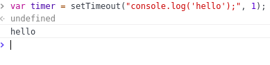
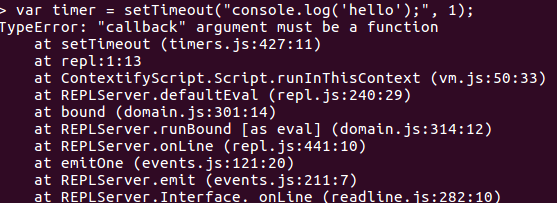
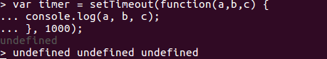
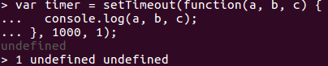
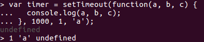

<!--
$theme: gaia
template: gaia
-->


Node.js基础
四、全局变量<p style="text-align:right;font-size:28px;margin-right:50px;color:#cFc;">:star: by calidion</p>
===
---
全局变量global
===
查看全局变量
```
$> node
> for (var k of Object.keys(global)) { console.log(k);}
console
global
process
Buffer
clearImmediate
clearInterval
clearTimeout
setImmediate
setInterval
setTimeout
module
require
```
---
global
===
是一个包含所有全局变量的变量
它同时包含了自己

但是，其中：
module
require

并不是全局变量

而是一种会在每个模块都存在的变量
是模块级别的局部变量

---
console
===
一个简单的调试器，用于模拟浏览器端的console。
console英文的意思是安慰，使舒服。
这里可以理解为让你控制计算机更加的舒服。
console => terminal
1. console 是 Console类的一个对象，可以配置它的方法写入到任何node.js支持的流中去
2. console默认被配置到process.stdout和process.stderr

---
process
===
当前进程，提供了进程的相关信息与控制等能力
1. 是承继于EventEmitter的对象
2. 能对事件进行响应
3. 包含了stdin,stdout,stderr
4. 包含了用户与组管理接口
5. 包含了进程启动的参数

---
定时器(timers)
===
1. setImmediate(callback[, ...args])
2. setTimeout(callback, delay[, ...args])
3. setInterval(callback, delay[, ...args])

其中：
a. 1返回类Immediate的对象
b. 2,3返回类Timeout的对象

---
setXXX参数说明
===
格式
```
setImmediate(callback[, ...args])
```
callback 必须是函数，不能是字符。这与前端的JS存在差别。
delay 是毫秒数，最小是1
...args 任意数量的参数，用以传给callback函数

---
必须是函数示例
===
```
var timer = setTimeout("console.log('hello');", 1);
```
在浏览器端执行正常:


在node.js里执行会报错:


---

arg参数的传递
===
1. 无参数传入时
```
$> var timer = setTimeout(function(a, b, c) {
  console.log(a, b, c);
}, 1000);
```
输出:
```
undefined undefined undefined
```
图示：



---
2. 传入一个参数
```
$> var timer = setTimeout(function(a, b, c) {
  console.log(a, b, c);
}, 1000, 1);
```

输出:
```
 1 undefined undefined
```
图示：



---

3. 传入二个参数
```
$> var timer = setTimeout(function(a, b, c) {
  console.log(a, b, c);
}, 1000, 1, 'a');
```

输出:
```
 1 'a' undefined
```
图示：



---
setImmediate
===
设定执行完回调，即这个调用可能是比较消耗时间的，暂时不阻止主进程的执行，等主进程执行完之后再执行。

```
var timer = setImmediate(function(a, b, c) {
  console.log(a, b, c);
}, 1000, 1, 'a');
console.log("hello");
```
输出:
```
hello
1000 1 'a'
```
---
Buffer
===
在没有出现[TypedArray](https://developer.mozilla.org/en-US/docs/Web/JavaScript/Reference/Global_Objects/TypedArray)之前,Node创建它用于处理二进制。
有了Buffer，在处理网络IO与文件IO时，数据流就可以处理了。
而JS在ES6之前是没有处理二进制的能力的。
Buffer是处理二进制之间的转换的，不是用于字符转换的。

---
模块机制
===
module
require
都是模块的机制下的参数，
在每个文件或者运行环境都会存在，
但是他们不是全局级别的


