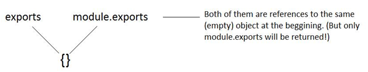

<!--
$theme: gaia
template: gaia
-->


Node.js基础
五、模块<p style="text-align:right;font-size:28px;margin-right:50px;color:#cFc;">:star: by calidion</p>
===
---
Node.js的模块机制与模块
===
1. Node.js是通过模块的形式进行组织与调用的

2. 所以系统自带了很多模块

3. 同时也提供了新模块的扩展机制

---
系统自带的模块
===
通过`process.moduleLoadList`打印的`NativeModule`可以查看到相关的模块信息。主要的系统模块包括：

[ 'assert', 'buffer', 'console', 'dns', 'domain', 'events', 'fs', 'module', 'net', 'os', 'path', 'querystring', 'readline', 'repl', 'stream', 'string_decoder', 'timers', 'tty', 'url', 'util', 'vm' ] 

其中最能代表node.js的最初思想的是net, 'events'这两个模块。

---
module及其变量
===
在node.js里通常一个文件就可以是一个模块
并且每个模块都包含下面几个模块变量：
1. \_\_dirname
获取当前文件所在目录
2. \_\_filename
获取当前文件名
3. exports
到module.exports的引用
4. module
当前模块
---
5. require()
模块加载的函数

---
模块加载
===
使用require()函数加载模块

这是最普遍，也是最原始的模块引入方式
比如引用path，那么我们就使用
```
var path = require('path')
console.log(path.sep)
```
然后可以输出：
```
'/'
```

---
创建一个模块并调用它
===
```
//hello.js
module.exports = function() {
  console.log("Hello world!");
};
```
然后在另一个文件调用：
```
var hello = require('./hello');
hello();
```
然后输出:
```
Hello world!
```
---
module.exports与exports
===
1.默认exports与module.exports指向相同的对象的引用，并且此对象是一个空对象{}。



2. 对他们添加属性，不会破坏他们的一致性
3. 对他们直接使用赋值号，则会破坏他们的引用关系
4. 导出以module.exports为准

---
对属性修改不会导致不相等
===
```
console.log(module.exports === exports);   // true
console.log(exports.a);  // undefined

// 修改exports
module.exports.a = 100;
console.log(module.exports === exports);  // true
console.log(exports);  // { a: 100 }

// 修改exports
exports.b = {
	a: 100
};
console.log(module.exports === exports); // true
console.log(exports); 
// { a: 100, b: { a: 100 } }
```
---
直接赋值会导致两者不相等
===
1. 修改module.exports
```
console.log(module.exports === exports);
module.exports = {c:100};
console.log(exports);
console.log(module.exports);
console.log(module.exports === exports);
```
结果：
```
true
{}
{ c: 100 }
false
```

---
2.直接修改exports
```
console.log(module.exports === exports);
exports = {
	c:100
};
console.log(exports);
console.log(module.exports);
console.log(module.exports === exports);
```
结果：
```
true
{ c: 100 }
{}
false

```
---
模块化的基本要求
===
1. 高内聚
2. 低耦合
3. 逻辑清晰正确
4. 要有输出
4. 高扇入，低扇出
5. 减少冗余（相同类型不要超过三遍）

---
实践
===

1. 模块内避免直接打印调试信息，可以通过条件来开启打印信息
2. 合理的命名
3. 合理的格式规范


