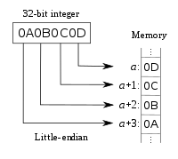

<!--
$theme: gaia
template: gaia
-->


Node.js基础
Buffer与流<p style="text-align:right;font-size:28px;margin-right:50px;color:#cFc;">:star: by calidion</p>
===
---
什么是Buffer?
===
1. Buffer就是Node.js处理二进制数据的容器
在ES6之前，JS并没有处理二进制的机制,
在ES6之后，JS使用了TypedArray里的Uint8Array作为Buffer的底层
Buffer类似于整数的数组，但是长度受限(8bit)
2. 存储的机制并不属于V8管理
3. 属于全局变量，不需要调用require('buffer').Buffer

>v8之前的node.js没有初始化Buffer,v8之后默认初始化


---
Buffer的使用
===
1. 创建一定长度的Buffer，并初始化为0

```
const LEN = 10;
const b = Buffer.alloc(LEN);
// b => <Buffer 00 00 00 00 00 00 00 00 00 00>
```
这里创建了长度为10的Buffer数组， 并且初始值是0

2. 创建带初始值的Buffer

```
const c = Buffer.alloc(10, 'a');
// c => <Buffer 61 61 61 61 61 61 61 61 61 61>
```
---

3. 创建不初始化的Buffer
```
const d = Buffer.allocUnsafe(10);
// d => <Buffer f8 b1 7d a1 7c 7f 00 00 00 99>
```

4. 从数组开始初始化Buffer
```
const e = Buffer.from(['a', 'b', 'c'], 'latin1');
// e => <Buffer 00 00 00>
const f = Buffer.from([3, 2, 1]);
// f => <Buffer 03 02 01>
```

---

5. 从字符以UTF-8形式存储
```
const g = Buffer.from('中国', 'utf8');
// g => <Buffer e4 b8 ad e5 9b bd>
还原为字符
g.toString()
// 中国

```

6. 以指定字符集存储
```
const h = Buffer.from('中国', 'latin1');
// h => <Buffer 2d fd>
const i = Buffer.from('sf', 'latin1');
// i => <Buffer 73 66>
```
---

7. 拼接buffer

a. 固定的拼接

```
const buf1 = Buffer.alloc(10);
const buf2 = Buffer.alloc(14);
const buf3 = Buffer.alloc(18);
const totalLength = buf1.length + buf2.length + buf3.length;

// Prints: 42
console.log(totalLength);

const bufA = Buffer.concat([buf1, buf2, buf3], totalLength);

// Prints: <Buffer 00 00 00 00 ...>
console.log(bufA);

// Prints: 42
console.log(bufA.length);

```
---
b. 拼接并转化成字符串

```
const buf1 = Buffer.from("我的", "utf8");
const buf2 = Buffer.from("家乡", "utf8");
const buf3 = Buffer.from("最美", "utf8");
const totalLength = buf1.length + buf2.length + buf3.length;

// Prints: 42
console.log(totalLength);

const bufA = Buffer.concat([buf1, buf2, buf3], totalLength);

// Prints: <Buffer 00 00 00 00 ...>
console.log(bufA);

// Prints: 42
console.log(bufA.length);

```

c. 对流的拼接

```

var fs = require('fs');
var rs = fs.createReadStream('file.txt');
var data = '';
rs.on("data", function (trunk){
    data += trunk;
});
rs.on("end", function () {
    console.log(data);
});

```
---
little endian vs big endian
===
endian，端
little endian，小端优先（即先存储小的）

big endian，大端优先（即先存储大的）


---
Buffer与数值的转换
===
1. 整数
整数类型：UInt8, Int8, UInt16, Int16, UInt, Int

```
> const buf1 = Buffer.allocUnsafe(8)
> buf1.writeUIntBE(0x1234567890abcd, 0, 8)
8
> buf1.readUIntBE()
> buf1.writeUIntLE(0x1234567890abcd, 0, 8)
8
> buf1
<Buffer cd ab 90 78 56 34 12 00>
```

---

2. 浮点数
```
> let a = new Buffer(4)
undefined
> a
<Buffer 00 00 00 00>
> a.writeFloatLE(1.3)
4
> a
<Buffer 66 66 a6 3f>
> a.writeFloatBE(1.3)
4
> a
<Buffer 3f a6 66 66>
> a.readFloatLE()
2.7230274755116964e+23
> a.readFloatBE()
1.2999999523162842
```
---

3. double
```
> let b = new Buffer(8)
undefined
> b.writeFloatLE(1.4)
4
> b
<Buffer 33 33 b3 3f 00 00 00 00>
> b.writeDoubleLE(1.4)
8
> b
<Buffer 66 66 66 66 66 66 f6 3f>
> b.writeFloatLE(1.4)
4
> b
<Buffer 33 33 b3 3f 66 66 f6 3f>
> b.readDoubleBE()
4.7888499778884224e-62

```
---
Buffer与字符集
===
由于二进制的载体通常是字符串或者文本信息。
所以Buffer支持与这些文本的转换是非常有价值的
目前支持相互转换的字符编码格式主要有：
1. ascii 只支持七位(bit)的字符，最高位置忽略
2. utf-8 Web网络广泛支持的字符串编码格式，是用于传输多字节的Unicode编码
3. ucs16le 2或者4个字符，Unicode字符集
4. ucs2 ucs16le的别名
5. base64 BASE64编码

---

6. latin1 一个让Buffer编码成一个字节的编码方式
7. binary latin1的别名
8. hex 将每一个字节用两个字符表示， 如0xa1

示例：

```
const buf = Buffer.from('hello world', 'ascii');

// Prints: 68656c6c6f20776f726c64
console.log(buf.toString('hex'));

// Prints: aGVsbG8gd29ybGQ=
console.log(buf.toString('base64'));
```
---

Buffer比较相等与字符集的比较相等
===
Buffer
```
var a = new Buffer([1, 2, 3, 4]);
var b = new Buffer([1, 2, 3, 4]);
Buffer.compare(a, b) === 0)
b.equals(a)
```

---

流(Stream)
===
1. 在Node.js里，流是最核心的输入输出，以及交换方式
2. 无论是文件，网络信息，标准的输入输出都是以流的方式传递的
3. 流是一个相对抽象的概念
4. 都是EventEmitter的实例
5. 大部分情况下，我们会自动的接触到流而不必新建
6. stream提供新建流的接口

---
四种类型
===

1. Readable
可以读取的流，比如 fs.createReadStream()
2. Writable
可以写入的流，比如 fs.createWriteStream()
3. Duplex
即可读，又可写的流，比如 net.Socket
4. Transform
即可读，又可写的流，但是读写需要在变换内容后才能实行。比如 zlib.createDeflate()

---
读写的缓存（Buffering)
===

Writable和Readable都有内部的缓存

分别是：

```writable._writableState.getBuffer()```
和
```readable._readableState.buffer```

缓存的大小由选项：highWaterMark 指定

---
Readable
===
可以读取的流

1. 创建一个读取流

```
const { Readable } = require('stream');
const r = new Readable();
```

2. 创建一个读取流并指定缓存大小

```
const r = new Readable({highWaterMark: 1000});
```

---

3. 从文件读取


```
const fs = require('fs');
const rs = fs.createReadStream('foo.txt');
rs.on('readable', () => {
  let b = rs.read();
  console.log('readable:', b);
  console.log('readable:', b.toString('utf8'));
});
rs.on('end', () => {
  console.log('end');
});

```
---
4. Readable的实现

```
class SourceWrapper extends Readable {
  constructor(options) {
    super(options);
    this._source = getLowlevelSourceObject();

    // Every time there's data, push it into the internal buffer.
    this._source.ondata = (chunk) => {
      // if push() returns false, then stop reading from source
      if (!this.push(chunk))
        this._source.readStop();
    };
    // When the source ends, push the EOF-signaling `null` chunk
    this._source.onend = () => {
      this.push(null);
    };
  }
  // _read will be called when the stream wants to pull more data in
  // the advisory size argument is ignored in this case.
  _read(size) {
    this._source.readStart();
  }
}
```
---
Readable的事件
===
1. close 流关闭事件
2. data 数据接收事件

```
readable.on('data', (chunk) => {
  console.log(`Received ${chunk.length} bytes of data.`);
});
```
3. end 数据传输结束事件
```
readable.on('end', () => {
  console.log('There will be no more data.');
});
```
---

4. error  错误事件
```
readable.on('error', (error) => {
  console.log(error);
});
```

5. readable  有可读取数据事件
```
rs.on('readable', () => {
  let b = rs.read();
  console.log('readable:', b);
});
```

---
Writable
===

可以写入的流

1. 创建一个读取流

```
const { Writable } = require('stream');
const w = new Writable();
```

2. 创建一个读取流并指定缓存大小

```
const w = new Writable({highWaterMark: 1000});
```

---

3. 写入到文件
```
const fs = require('fs');
const ws = fs.createWriteStream('foo-out.txt');
ws.write("writed by WritableStream\n");
ws.end("\n");
ws.on('finish', () => {
	  console.log('All writes are now complete.');
});
```
---
Writable的事件
===
1. close 流关闭事件
2. drain 写入可用事件
```
 writable.once('drain', write);
```
3. error  错误事件
```
writable.on('error', (error) => {
  console.log(error);
});
```

---

4. finish 数据传输完成事件

```
writable.on('finish', () => {
  console.log('Files saved!');
});
```

5. pipe 被当成目标管道事件
```
const writer = getWritableStreamSomehow();
const reader = getReadableStreamSomehow();
writer.on('pipe', (src) => {
  console.error('something is piping into the writer');
  assert.equal(src, reader);
});
reader.pipe(writer);
```
---

6. unpipe 被取消当成目标管道事件
```
const writer = getWritableStreamSomehow();
const reader = getReadableStreamSomehow();
writer.on('unpipe', (src) => {
  console.error('Something has stopped piping into the writer.');
  assert.equal(src, reader);
});
reader.pipe(writer);
reader.unpipe(writer);
```
---
Duplex
===
同时需要实现Readable和Writable的对象

案例：
1. TCP Sockets
2. zlib流
3. crypto流

---
Transform
===
与Duplex一样需要同时实现Readable和Writable的对象
同时还需要添加变换功能

案例：
1. zlib流
2. crypto流

---
实现流所需要实现的方法
===

| 类 | 需要实现的方法 |
| :---: | :---: |
| Readable | \_read |
| Writable | \_write, \_writev, \_final |
| Duplex | _read, _write, _writev, _final |
| Transform | _transform, _flush, _final |

----


